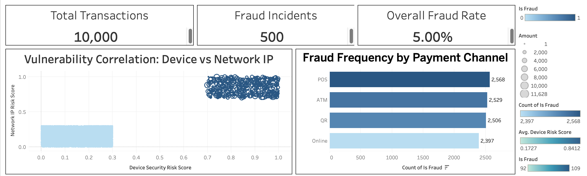
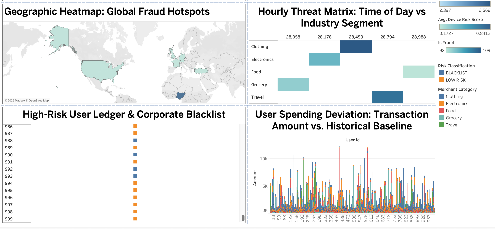

# Enterprise Fraud Risk & Threat Intelligence Workspace

## 📊 Project Overview
This project delivers an end-to-end analytics solution designed to detect financial anomalies, map global risk surfaces, and profile fraudulent account behavior. Utilizing a transactional dataset of 10,000 records, the workflow transitions from raw data auditing in PostgreSQL to an interactive, executive-level visualization canvas in Tableau.

👉 **[View the Live Interactive Tableau Dashboard Here]**
https://public.tableau.com/views/EnterpriseFraudRiskThreatIntelligenceDashboard/Dashboard1?:language=en-GB&publish=yes&:sid=&:redirect=auth&:display_count=n&:origin=viz_share_link
---

## 🛠️ Tools & Skills Demonstrated
* **Business Intelligence & Visualization:** Tableau Public
* **Data Auditing & Querying:** PostgreSQL (pgAdmin 4)
* **Dashboard Architecture:** Fixed-grid container layouts, dynamic cross-filtering actions, custom calculated fields, KPI metrics card generation, and Level of Detail (LOD) expressions (`{FIXED}`).

---

## 🚀 Key Insights Gained
* **Systemic Vulnerability Zones:** Isolated a distinct risk corridor where combined network IP risk scores and device risk scores simultaneously breach critical thresholds (>0.70), marking immediate high-priority targets.
* **Payment Channel Exploit Volumes:** Mapped and ranked total fraud incident volume across primary payment channels, pinpointing vulnerabilities across POS, ATM, QR, and Online transactions.
* **Hourly Threat Spikes:** Uncovered specific operational times windows by matching transaction timestamps against business categories, exposing peak fraudulent hours for targeted industries (e.g., Travel, Retail).
* **Geographic Fraud Hotspots:** Pinpointed high-density spatial fraud concentrations across international borders using global coordinate maps.
* **Forensic Account Ledgers:** Classified individual user profiles into actionable security tiers (`BLACKLIST`, `HIGH RISK`, `MEDIUM RISK`, `LOW RISK`) based on historical spending deviations and active incident metrics.

---

## 📊 Dashboard Preview

---
*Connect with me on https://www.linkedin.com/in/naved-malek/.*
